# Asgard Data Platform

A comprehensive FastAPI-based data platform that provides unified REST APIs for end-to-end data operations including data ingestion via Airbyte and data transformations using Kubernetes SparkOperator.

## 📚 Documentation

**Complete documentation is available in the [docs](./docs) folder:**

- **[📘 Complete Platform Documentation](./docs/DOCUMENTATION.md)** - Comprehensive guide covering architecture, APIs, deployment, troubleshooting, and best practices
- **[📗 Transformation APIs Guide](./docs/TRANSFORMATION_APIs_DOCUMENTATION.md)** - Deep dive into Spark and DBT transformation APIs with examples and use cases
- **[📖 Documentation Index](./docs/README.md)** - Navigation guide to all documentation

## 🚀 Quick Start

### Prerequisites

- Python 3.11+
- [uv](https://docs.astral.sh/uv/) package manager
- Running Airbyte instance (for data ingestion)
- Kubernetes cluster with SparkOperator (for transformations)
- S3-compatible storage

### 1. Installation

```bash
# Clone the repository
git clone <repository-url>
cd asgard-dev

# Install dependencies
uv sync

# Copy environment configuration
cp .env.example .env
```

### 2. Configuration

Edit `.env` with your service configuration:

```bash
# Airbyte Configuration
AIRBYTE_BASE_URL=http://localhost:8001/api/public/v1

# Kubernetes Configuration
SPARK_IMAGE=your-registry/spark-custom:latest
SPARK_SERVICE_ACCOUNT=spark-sa
S3_SECRET_NAME=s3-credentials

# Environment
ENVIRONMENT=development
```

### 3. Start the Platform

```bash
# Start the API server
uv run python -m uvicorn app.main:app --reload --host 0.0.0.0 --port 8000
```

The API will be available at:

- **API**: http://localhost:8000
- **API Docs**: http://localhost:8000/docs
- **Health Check**: http://localhost:8000/health

## 📖 API Reference

### Data Ingestion APIs (Airbyte Integration)

#### List Data Sources

```bash
GET /datasource
```

#### Create Data Source

```bash
POST /datasource
Content-Type: application/json

{
  "source_type": "postgres",
  "workspace_name": "default",
  "source_config": {
    "host": "localhost",
    "port": 5432,
    "username": "user",
    "password": "password",
    "database": "mydb"
  },
  "name": "My Postgres Source"
}
```

#### List Data Sinks

```bash
GET /sink
```

#### Create Data Sink

```bash
POST /sink
Content-Type: application/json

{
  "destination_type": "s3",
  "workspace_name": "default",
  "destination_config": {
    "s3_bucket_name": "my-data-bucket",
    "s3_bucket_path": "bronze/",
    "aws_access_key_id": "your_key",
    "aws_secret_access_key": "your_secret"
  },
  "name": "My S3 Sink"
}
```

#### Start Data Ingestion

```bash
POST /ingestion
Content-Type: application/json

{
  "source_id": "source-uuid-here",
  "destination_id": "destination-uuid-here",
  "workspace_name": "default",
  "connection_name": "Postgres to S3 Sync"
}
```

### Data Transformation APIs (Spark Integration)

#### Submit Transformation Job

```bash
POST /transform
Content-Type: application/json

# Minimal request (recommended)
{
  "sql": "SELECT customer_id, SUM(amount) as total_amount FROM source_data GROUP BY customer_id"
}

# With custom Spark configuration
{
  "sql": "SELECT customer_id, SUM(amount) as total_amount FROM source_data GROUP BY customer_id",
  "write_mode": "overwrite",
  "executor_instances": 4,
  "executor_cores": 2,
  "executor_memory": "8g",
  "driver_cores": 2,
  "driver_memory": "4g"
}
```

#### Get Job Status

```bash
GET /transform/{run_id}/status
```

Response:

```json
{
  "run_id": "107ea972",
  "spark_application": "sql-exec-107ea972",
  "namespace": "default",
  "state": "COMPLETED",
  "driver_pod": "sql-exec-107ea972-driver",
  "executor_count": 2,
  "creation_time": "2025-08-27T10:04:59Z",
  "spark_version": "3.5.1"
}
```

#### Get Job Logs

```bash
GET /transform/{run_id}/logs
```

#### Get Job Events

```bash
GET /transform/{run_id}/events
```

#### Get Job Metrics

```bash
GET /transform/{run_id}/metrics
```

#### List All Jobs

```bash
GET /transform/jobs?limit=20&status_filter=COMPLETED
```

### Health & Documentation

#### Health Check

```bash
GET /health
```

#### API Documentation

```bash
GET /docs        # Interactive Swagger UI
GET /redoc       # ReDoc documentation
```

## 🏛️ Modular Architecture

### Layer Separation

```mermaid
graph TB
    subgraph "Presentation Layer"
        ROUTER[FastAPI Routers<br/>• Request/Response handling<br/>• Input validation<br/>• HTTP status codes]
    end

    subgraph "Business Logic Layer"
        SERVICE[Service Classes<br/>• Business logic<br/>• Orchestration<br/>• Data validation]
    end

    subgraph "Integration Layer"
        CLIENT[Client Classes<br/>• External API calls<br/>• Kubernetes operations<br/>• Protocol handling]
    end

    subgraph "External Systems"
        EXT[External Services<br/>• Airbyte<br/>• Kubernetes<br/>• S3 Storage]
    end

    ROUTER --> SERVICE
    SERVICE --> CLIENT
    CLIENT --> EXT
```



### Component Structure

```
app/
├── main.py                      # FastAPI application entry point
├── config.py                    # Configuration management
├── airbyte/                     # Airbyte integration module
│   ├── __init__.py
│   ├── router.py               # REST endpoints
│   ├── client.py               # Airbyte API client
│   └── schemas.py              # Request/response models
└── data_transformation/         # Spark transformation module
    ├── __init__.py
    ├── router.py               # REST endpoints (clean, 75 lines)
    ├── service.py              # Business logic layer
    ├── client.py               # Kubernetes client layer
    └── schemas.py              # Request/response models
```

### Design Principles

1. **Separation of Concerns**: Each layer has a single responsibility
2. **Dependency Injection**: Clean dependency management with FastAPI
3. **Abstraction**: External systems hidden behind client interfaces
4. **Testability**: Each component can be unit tested independently
5. **Maintainability**: Clear structure for easy maintenance and updates

## 📊 Data Processing Patterns

### Medallion Architecture

The platform implements the medallion (Bronze-Silver-Gold) architecture:

```mermaid
flowchart LR
    subgraph "Bronze Layer"
        RAW[Raw Data<br/>• Original format<br/>• No transformations<br/>• Historical archive]
    end

    subgraph "Silver Layer"
        CLEAN[Cleaned Data<br/>• Data quality checks<br/>• Schema standardization<br/>• Deduplication]
    end

    subgraph "Gold Layer"
        AGG[Aggregated Data<br/>• Business metrics<br/>• Analytics ready<br/>• Optimized for queries]
    end

    RAW --> CLEAN
    CLEAN --> AGG
    CLEAN --> RAW
    AGG --> RAW
```



### Transformation Workflow

1. **Bronze → Silver**: Data cleaning, validation, standardization
2. **Silver → Gold**: Business aggregations, metrics calculation
3. **Automated Detection**: Platform automatically detects S3 sources from Airbyte
4. **Flexible SQL**: Support for complex transformations using SQL

## 🔧 Configuration

### Environment Variables

| Variable                | Description                          | Default                               | Required |
| ----------------------- | ------------------------------------ | ------------------------------------- | -------- |
| `ENVIRONMENT`           | Deployment environment               | `development`                         | No       |
| `AIRBYTE_BASE_URL`      | Airbyte API base URL                 | `http://localhost:8001/api/public/v1` | Yes      |
| `SPARK_IMAGE`           | Docker image for Spark jobs          | -                                     | Yes      |
| `SPARK_SERVICE_ACCOUNT` | Kubernetes service account           | `spark-sa`                            | No       |
| `S3_SECRET_NAME`        | Kubernetes secret for S3 credentials | `s3-credentials`                      | No       |

### Request Schemas

#### Transformation Request

```json
{
  "sql": "string", // Required: SQL transformation query
  "write_mode": "overwrite|append", // Optional: Default "overwrite"
  "executor_instances": 2, // Optional: Default 2
  "executor_cores": 1, // Optional: Default 1
  "executor_memory": "512m", // Optional: Default "512m"
  "driver_cores": 1, // Optional: Default 1
  "driver_memory": "512m" // Optional: Default "512m"
}
```

#### Data Source Request

```json
{
  "source_type": "postgres|mysql|mongodb|kafka",
  "workspace_name": "string",
  "source_config": {
    "host": "string",
    "port": 5432,
    "username": "string",
    "password": "string",
    "database": "string"
  },
  "name": "string"
}
```

## 🛡️ Security & Best Practices

### Security Features

- Environment-based configuration (no secrets in code)
- SQL injection protection via parameterized queries
- Kubernetes RBAC integration
- S3 credentials managed via Kubernetes secrets

### Best Practices

- **Resource Management**: Configurable Spark resource allocation
- **Error Handling**: Comprehensive error responses and logging
- **Monitoring**: Built-in job status and metrics tracking
- **Scalability**: Horizontal scaling via Kubernetes
- **Observability**: Structured logging and metrics

## 📈 Monitoring & Observability

### Job Monitoring

- Real-time job status tracking
- Driver pod logs access
- Kubernetes events monitoring
- Resource usage metrics
- Job execution history

### Operational Metrics

- Job success/failure rates
- Execution time tracking
- Resource utilization
- Queue depth monitoring

## 🚀 Deployment

The platform is designed for cloud-native deployment:

### Kubernetes Deployment

- SparkOperator for Spark job management
- Service accounts and RBAC configuration
- Resource quotas and limits
- Horizontal pod autoscaling

### Docker Support

- Multi-stage builds for optimization
- Custom Spark images with dependencies
- Environment-specific configurations

## 📋 API Examples

### Complete Workflow Example

```bash
# 1. Create S3 sink for bronze data
curl -X POST "http://localhost:8000/sink" \
  -H "Content-Type: application/json" \
  -d '{
    "destination_type": "s3",
    "workspace_name": "default",
    "destination_config": {
      "s3_bucket_name": "data-lake",
      "s3_bucket_path": "bronze/"
    },
    "name": "Bronze Layer Sink"
  }'

# 2. Submit transformation job (automatically uses bronze as source)
curl -X POST "http://localhost:8000/transform" \
  -H "Content-Type: application/json" \
  -d '{
    "sql": "SELECT customer_id, SUM(amount) as total_spent, COUNT(*) as order_count FROM orders GROUP BY customer_id"
  }'

# Response: {"run_id": "abc123", "status": "submitted", ...}

# 3. Monitor job progress
curl "http://localhost:8000/transform/abc123/status"
curl "http://localhost:8000/transform/abc123/logs"

# 4. List all transformation jobs
curl "http://localhost:8000/transform/jobs"
```

## 🤝 Contributing

1. Fork the repository
2. Create a feature branch
3. Make your changes
4. Add tests
5. Submit a pull request

## 📄 License

[Add your license information here]

The API will be available at:

- **API**: http://localhost:8001
- **API Docs**: http://localhost:8001/docs
- **Transformation**: http://localhost:8001/transformation

## 📖 API Usage

### Spark Transformations

#### Submit a Spark Transformation Job

**Note**: The `/transform` API automatically detects source and destination from Airbyte S3 sinks. All Spark configuration has sensible defaults.

```bash
curl -X POST "http://localhost:8001/transform" \
     -H "Content-Type: application/json" \
     -d '{
       "sql": "SELECT customer_id, SUM(amount) as total_amount FROM source_data GROUP BY customer_id"
     }'
```

**Optional**: You can still override Spark configuration if needed:

```bash
curl -X POST "http://localhost:8001/transform" \
     -H "Content-Type: application/json" \
     -d '{

       "sql": "SELECT customer_id, SUM(amount) as total_amount FROM source_data GROUP BY customer_id",
       "write_mode": "overwrite",
       "executor_instances": 4,
       "executor_memory": "8g"
     }'
```

### Airbyte Data Integration

#### Create a Data Source

```bash
curl -X POST "http://localhost:8001/datasource" \
     -H "Content-Type: application/json" \
     -d '{
       "source_type": "postgres",
       "workspace_name": "default",
       "source_config": {
         "host": "localhost",
         "port": 5432,
         "username": "user",
         "password": "password",
         "database": "mydb"
       },
       "name": "My Postgres Source"
     }'
```

#### Create a Data Sink

```bash
curl -X POST "http://localhost:8001/sink" \
     -H "Content-Type: application/json" \
     -d '{
       "destination_type": "s3",
       "workspace_name": "default",
       "destination_config": {
         "bucket_name": "my-data-bucket",
         "aws_access_key_id": "your_key",
         "aws_secret_access_key": "your_secret"
       },
       "name": "My S3 Sink"
     }'
```

#### Start Data Ingestion

```bash
curl -X POST "http://localhost:8001/ingestion" \
     -H "Content-Type: application/json" \
     -d '{
       "source_id": "source-uuid-here",
       "destination_id": "destination-uuid-here",
       "workspace_name": "default",
       "connection_name": "Postgres to S3 Sync"
     }'
```

#### List Data Sources and Sinks

```bash
# List data sources
curl "http://localhost:8001/datasource"

# List data sinks
curl "http://localhost:8001/sink"
```

## 📋 API Endpoints

### Transformation API (Airflow Integration)

- `GET /health` - Health check

### Spark Transformation API (Kubernetes Integration)

- `POST /transform` - Submit Spark transformation job (auto-detects source/destination)

### Airbyte Integration API

- `GET /datasource` - List available data sources
- `POST /datasource` - Create new data source
- `GET /sink` - List available data sinks
- `POST /sink` - Create new data sink
- `POST /ingestion` - Start data ingestion job

### Documentation

- `GET /docs` - Interactive API documentation

## 🔧 Configuration

### Environment Variables

| Variable                | Description                          | Default                 |
| ----------------------- | ------------------------------------ | ----------------------- |
| `AIRBYTE_BASE_URL`      | Airbyte base URL                     | `http://localhost:8000` |
| `PIPELINE_NAMESPACE`    | Kubernetes namespace for Spark jobs  | `asgard`                |
| `SPARK_IMAGE`           | Docker image for Spark jobs          | Required                |
| `SPARK_SERVICE_ACCOUNT` | Kubernetes service account           | `spark-sa`              |
| `S3_SECRET_NAME`        | Kubernetes secret for S3 credentials | `s3-credentials`        |

### Request Schema

#### Spark Transformation Request (Kubernetes)

**Minimal Request** (recommended):

```json
{
  "sql": "string"
}
```

**With Optional Spark Configuration** (all have sensible defaults):

```json
{
  "sql": "string",
  "write_mode": "overwrite|append",
  "executor_instances": 2,
  "executor_cores": 2,
  "executor_memory": "4g",
  "driver_cores": 1,
  "driver_memory": "2g"
}
```

**Note**: Both transformation APIs automatically determine source and destination from registered Airbyte S3 sinks. The system uses the first available S3 sink as the source location and creates the destination in the same bucket under the 'silver/' folder.

#### Data Source/Sink Request

```json
{
  "source_type": "postgres|mysql|mongodb|kafka",
  "destination_type": "s3",
  "workspace_name": "default",
  "config": {
    "s3_bucket_name": "string",
    "s3_bucket_path": "string"
  },
  "name": "string"
}
```

## 🏗️ Architecture

### Data Transformation Pipeline

```
Client Request → FastAPI → Kubernetes → SparkApplication → S3 Output
```

### Data Ingestion Pipeline

```
Client Request → FastAPI → Airbyte API → Data Sources → Data Sinks
```

### Unified Workflow

```
1. Data Sources → Airbyte Ingestion → S3 Bronze Layer
2. S3 Bronze Layer → Spark Transformation → S3 Silver Layer
3. S3 Silver Layer → Further Processing → S3 Gold Layer
```

The platform provides:

#### Airbyte Integration:

1. Simplified data source configuration (Postgres, MySQL, MongoDB, Kafka)
2. Data sink management (S3, etc.)
3. Connection and ingestion job management
4. Automated data pipeline setup

#### Airflow Integration:

1. **Automatic Source Detection**: Uses registered Airbyte S3 sinks as transformation sources

#### Spark Integration:

1. **Automatic Source Detection**: Uses registered Airbyte S3 sinks as transformation sources
2. **Medallion Architecture**: Automatically creates 'silver' layer destinations
3. Converts SQL queries to Kubernetes SparkApplications
4. Executes Spark jobs on Kubernetes using SparkOperator
5. Returns job status and execution details

#### Typical Workflow:

1. **Bronze Layer**: Register S3 sink via `/sink` endpoint → Ingest raw data via Airbyte
2. **Silver Layer**: Submit transformation job via `/transform` → Process data with Spark
3. **Gold Layer**: Run additional transformations for analytics-ready data

## 📁 Project Structure

```
asgard-dev/
├── app/
│   ├── airbyte/          # Airbyte integration (data ingestion)
│   ├── data_transformation/ # Spark transformation (Kubernetes)
│   ├── config.py         # Configuration
│   └── main.py           # FastAPI app
├── .env                  # Environment variables
├── pyproject.toml        # Dependencies and config
├── uv.lock               # Lock file
```

## 🔒 Security

- Basic SQL injection protection
- Environment-based configuration
- No sensitive data in code
