# Asgard Platform - Complete Architecture & Visual Guide

**Unified Technical Architecture, Diagrams & System Design**  
**Last Updated:** November 24, 2025  
**Version:** 2.0

---

## 📋 Table of Contents

1. [Platform Overview](#platform-overview)
2. [Technology Stack](#technology-stack)
3. [Architecture Diagrams](#architecture-diagrams)
4. [Component Design](#component-design)
5. [Data Flow Architecture](#data-flow-architecture)
6. [Iceberg Integration](#iceberg-integration)
7. [Feast Feature Store](#feast-feature-store)
8. [MLflow Integration](#mlflow-integration)
9. [Sequence Diagrams](#sequence-diagrams)
10. [Network & Storage Architecture](#network--storage-architecture)
11. [Security & Performance](#security--performance)
12. [Reference Tables](#reference-tables)

---

## Platform Overview

### High-Level System Design

Asgard is a **unified data lakehouse platform** built on Kubernetes that orchestrates the complete data lifecycle from ingestion to ML deployment through a single FastAPI gateway.

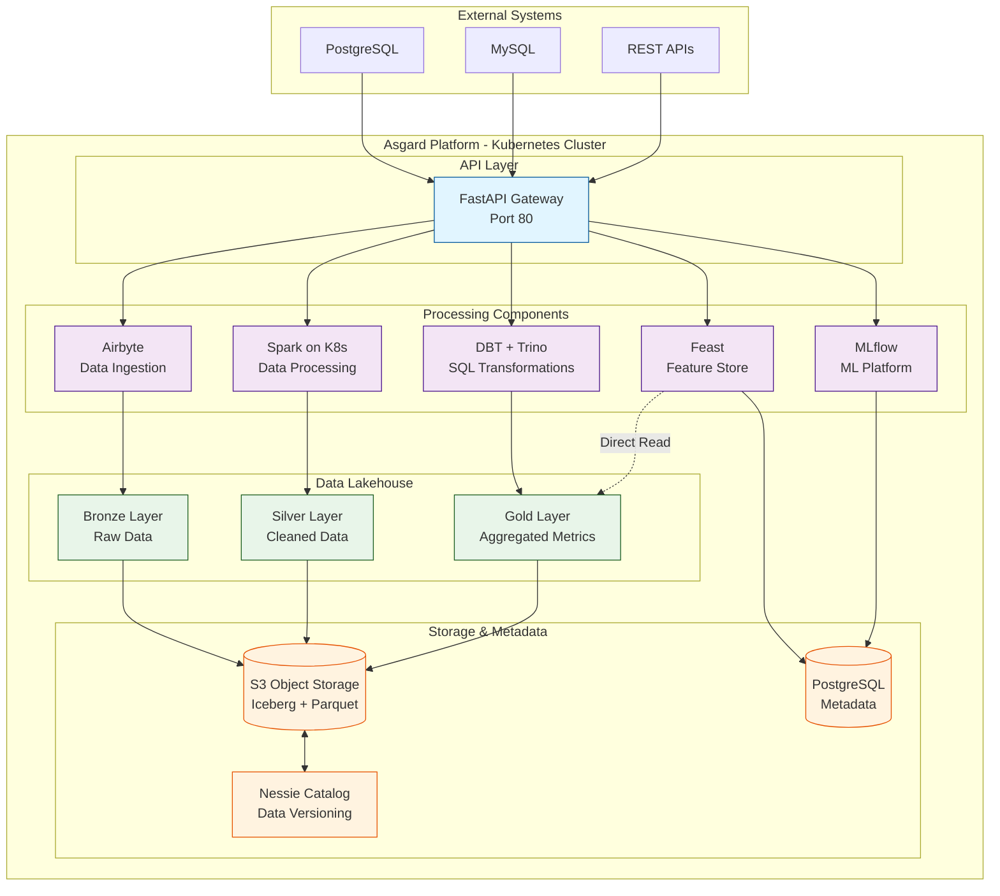

### Key Architectural Principles

1. **API-First Design** - All operations accessible via REST API
2. **Medallion Architecture** - Bronze → Silver → Gold data layers
3. **Zero Data Duplication** - Feast reads directly from Iceberg S3 Parquet
4. **Kubernetes Native** - Cloud-agnostic, scalable deployment
5. **Separation of Concerns** - Each component has a single responsibility
6. **Event-Driven** - Asynchronous job execution with status tracking

---

## Technology Stack

### Core Components

| Layer               | Component      | Version     | Purpose                        |
| ------------------- | -------------- | ----------- | ------------------------------ |
| **API Gateway**     | FastAPI        | 0.104+      | REST API server                |
| **Data Ingestion**  | Airbyte        | OSS         | CDC and data connectors        |
| **Data Processing** | Apache Spark   | 3.5.0       | Distributed data processing    |
| **SQL Transform**   | DBT + Trino    | 1.6+ / 428+ | SQL-based transformations      |
| **Feature Store**   | Feast          | 0.35+       | Feature management             |
| **ML Platform**     | MLflow         | 2.16.2      | Experiment tracking & registry |
| **Data Lakehouse**  | Apache Iceberg | 1.5+        | Table format                   |
| **Data Catalog**    | Project Nessie | 0.74+       | Version control for data       |
| **Object Storage**  | AWS S3         | -           | Data and artifact storage      |
| **Metadata DB**     | PostgreSQL     | 13+         | MLflow backend, Feast registry |
| **Orchestration**   | Kubernetes     | 1.27+       | Container orchestration        |
| **Spark Operator**  | Spark on K8s   | 3.5.0       | Spark job management           |

### Language & Frameworks

| Technology  | Version | Usage                               |
| ----------- | ------- | ----------------------------------- |
| **Python**  | 3.11    | Primary language for all services   |
| **PySpark** | 3.5.0   | Spark transformations               |
| **SQL**     | -       | DBT models, Trino queries           |
| **YAML**    | -       | Configuration, Kubernetes manifests |
| **Parquet** | -       | Data storage format                 |

---

## Architecture Diagrams

### Complete System Architecture

```mermaid
flowchart TB
    subgraph Client["Client Layer"]
        User[Data Engineer/ML Engineer]
        API_Docs[Swagger UI<br/>localhost:8000/docs]
    end

    subgraph API["API Layer - FastAPI Gateway"]
        Router_Airbyte[/datasource<br/>/datasink<br/>/ingestion]
        Router_Spark[/spark/transform]
        Router_DBT[/dbt/transform]
        Router_Feast[/feast/features<br/>/feast/status]
        Router_MLOps[/mlops/training<br/>/mlops/inference]
    end

    subgraph Platform["Platform Components"]
        direction TB

        subgraph Airbyte_System["Airbyte Platform"]
            Airbyte_Server[Airbyte Server]
            Airbyte_Worker[Workers]
            Airbyte_Temporal[Temporal]
        end

        subgraph Spark_System["Spark on Kubernetes"]
            Spark_Operator[Spark Operator]
            Spark_Driver[Driver Pod]
            Spark_Executors[Executor Pods]
        end

        subgraph DBT_System["DBT + Trino"]
            DBT_Service[DBT Service]
            Trino_Coordinator[Trino Coordinator]
            Trino_Workers[Trino Workers]
        end

        subgraph Feast_System["Feast Feature Store"]
            Feast_Registry[(Feature Registry<br/>PostgreSQL)]
            Feast_OfflineStore[Offline Store<br/>File-based]
        end

        subgraph MLflow_System["MLflow Platform"]
            MLflow_Tracking[Tracking Server]
            MLflow_Registry[Model Registry]
            MLflow_Inference[Inference Service]
        end
    end

    subgraph Lakehouse["Data Lakehouse - Medallion Architecture"]
        direction LR
        Bronze[Bronze Layer<br/>Raw Data<br/>Parquet]
        Silver[Silver Layer<br/>Cleaned Data<br/>Parquet]
        Gold[Gold Layer<br/>ML-Ready Features<br/>Parquet]

        Bronze -->|Spark SQL<br/>Cleansing| Silver
        Silver -->|DBT + Trino<br/>Aggregation| Gold
    end

    subgraph Storage["Storage & Catalog"]
        S3[(S3 Object Storage<br/>s3://airbytedestination1)]
        Nessie[Nessie Catalog<br/>Git-like Versioning]
        Postgres[(PostgreSQL<br/>Metadata Store)]
    end

    User --> API_Docs
    API_Docs --> Router_Airbyte & Router_Spark & Router_DBT & Router_Feast & Router_MLOps

    Router_Airbyte --> Airbyte_Server
    Router_Spark --> Spark_Operator
    Router_DBT --> DBT_Service
    Router_Feast --> Feast_Registry
    Router_MLOps --> MLflow_Tracking

    Airbyte_Server --> Airbyte_Worker & Airbyte_Temporal
    Spark_Operator --> Spark_Driver --> Spark_Executors
    DBT_Service --> Trino_Coordinator --> Trino_Workers

    Airbyte_Worker -->|Write| Bronze
    Spark_Executors -->|Read/Write| Bronze & Silver
    Trino_Workers -->|Read/Write| Silver & Gold

    Bronze & Silver & Gold --> S3
    S3 <-->|Metadata| Nessie

    Feast_OfflineStore -.Direct S3 Read<br/>NO COPY!.-> Gold
    Feast_Registry & MLflow_Tracking --> Postgres
    MLflow_Tracking -->|Artifacts| S3

    classDef clientStyle fill:#e3f2fd,stroke:#1976d2,stroke-width:2px
    classDef apiStyle fill:#fff3e0,stroke:#f57c00,stroke-width:2px
    classDef processStyle fill:#f3e5f5,stroke:#7b1fa2,stroke-width:2px
    classDef dataStyle fill:#e8f5e9,stroke:#388e3c,stroke-width:2px
    classDef storageStyle fill:#fce4ec,stroke:#c2185b,stroke-width:2px

    class User,API_Docs clientStyle
    class Router_Airbyte,Router_Spark,Router_DBT,Router_Feast,Router_MLOps apiStyle
    class Airbyte_System,Spark_System,DBT_System,Feast_System,MLflow_System processStyle
    class Bronze,Silver,Gold dataStyle
    class S3,Nessie,Postgres storageStyle
```

### Data Flow - End-to-End Pipeline

```mermaid
flowchart LR
    subgraph Sources["External Sources"]
        PG[(PostgreSQL)]
        MySQL[(MySQL)]
        APIs[REST APIs]
    end

    subgraph Phase1["Phase 1: Ingestion"]
        Airbyte_Sync[Airbyte Sync Job]
        Bronze_Store[(Bronze Layer<br/>100K rows<br/>Raw as-is)]
    end

    subgraph Phase2["Phase 2: Cleansing"]
        Spark_Clean[Spark SQL<br/>- Deduplication<br/>- Type Casting<br/>- Null Handling]
        Silver_Store[(Silver Layer<br/>98.5K rows<br/>Cleaned)]
    end

    subgraph Phase3["Phase 3: Aggregation"]
        DBT_Agg[DBT + Trino<br/>- Joins<br/>- Aggregations<br/>- Feature Engineering]
        Gold_Store[(Gold Layer<br/>ML-Ready Features)]
    end

    subgraph Phase4["Phase 4: Feature Store"]
        Feast_Register[Feast Registration<br/>Direct S3 Path]
        Feature_Views[Feature Views<br/>Time-Travel Queries]
    end

    subgraph Phase5["Phase 5: ML Training"]
        MLflow_Train[MLflow Training<br/>- Fetch Features<br/>- Train Model<br/>- Log Metrics]
        Model_Registry[(Model Registry<br/>Versioned Models)]
    end

    subgraph Phase6["Phase 6: Inference"]
        Inference_API[Inference Service<br/>Predictions]
        Applications[ML Applications]
    end

    PG & MySQL & APIs --> Airbyte_Sync
    Airbyte_Sync -->|Write Parquet| Bronze_Store
    Bronze_Store --> Spark_Clean
    Spark_Clean -->|Write Parquet| Silver_Store
    Silver_Store --> DBT_Agg
    DBT_Agg -->|Write Parquet| Gold_Store
    Gold_Store -.Direct Read.-> Feast_Register
    Feast_Register --> Feature_Views
    Feature_Views --> MLflow_Train
    MLflow_Train --> Model_Registry
    Model_Registry --> Inference_API
    Inference_API --> Applications

    classDef sourceStyle fill:#e1f5fe,stroke:#01579b
    classDef transformStyle fill:#f3e5f5,stroke:#6a1b9a
    classDef dataStyle fill:#e8f5e9,stroke:#2e7d32
    classDef mlStyle fill:#fff3e0,stroke:#ef6c00

    class PG,MySQL,APIs sourceStyle
    class Airbyte_Sync,Spark_Clean,DBT_Agg transformStyle
    class Bronze_Store,Silver_Store,Gold_Store,Feature_Views dataStyle
    class Feast_Register,MLflow_Train,Model_Registry,Inference_API,Applications mlStyle
```

---

## Component Design

### 1. FastAPI Gateway

**Purpose**: Unified REST API for all platform operations

**Architecture**:

```
app/
├── __init__.py
├── main.py               # FastAPI application
├── config.py             # Configuration management
│
├── airbyte/              # Airbyte integration
│   ├── router.py         # API endpoints
│   ├── schemas.py        # Pydantic models
│   └── client.py         # Airbyte API client
│
├── data_transformation/  # Spark integration
│   ├── router.py
│   ├── schemas.py
│   ├── client.py         # Spark Operator client
│   └── service.py        # Business logic
│
├── dbt_transformations/  # DBT integration
│   ├── router.py
│   ├── schemas.py
│   └── service.py        # DBT + Trino orchestration
│
├── feast/                # Feast integration
│   ├── router.py
│   ├── schemas.py
│   └── service.py        # Feature store operations
│
├── mlops/                # MLOps integration
│   ├── router.py
│   ├── schemas.py
│   ├── service.py        # Training orchestration
│   └── deployment_service.py  # Inference serving
│
└── data_products/        # Direct data access
    ├── router.py
    ├── schemas.py
    └── client.py         # Trino client
```

**Key Features**:

- **OpenAPI/Swagger** - Auto-generated API documentation
- **Pydantic Validation** - Type-safe request/response models
- **Async Support** - Non-blocking I/O for better performance
- **Dependency Injection** - Clean separation of concerns
- **Error Handling** - Standardized error responses

### 2. Airbyte Platform

**Purpose**: Data ingestion from external sources to Bronze layer

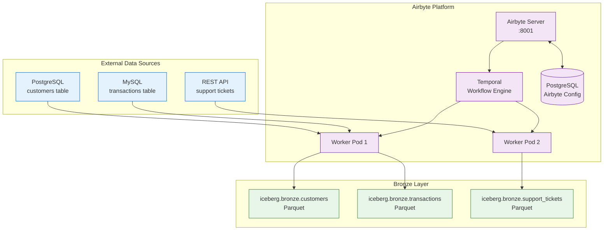

**Data Flow**:

```
Source DB → Airbyte Connector → Normalization → S3/Iceberg (Bronze)
```

**Supported Sources**:

- PostgreSQL
- MySQL
- MongoDB
- REST APIs
- File sources (CSV, JSON)

### 3. Spark on Kubernetes

**Purpose**: Distributed data processing (Bronze → Silver)

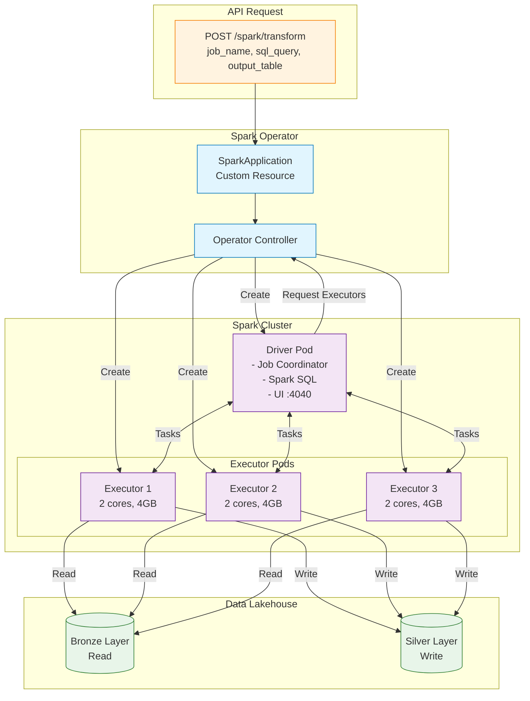

**Key Capabilities**:

- **SQL-based transformations** via Spark SQL
- **Iceberg integration** for reading/writing tables
- **Dynamic resource allocation**
- **Auto-scaling** executors based on workload
- **Job monitoring** via Spark UI

### 4. DBT + Trino

**Purpose**: SQL-based business logic transformations (Silver → Gold)

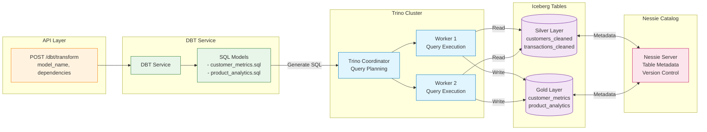

**Key Features**:

- **SQL-first** approach for data transformations
- **Incremental models** for efficient processing
- **Testing framework** for data quality
- **Documentation** generation
- **Lineage tracking**

### 5. Feast Feature Store

**Purpose**: Feature management for ML workflows

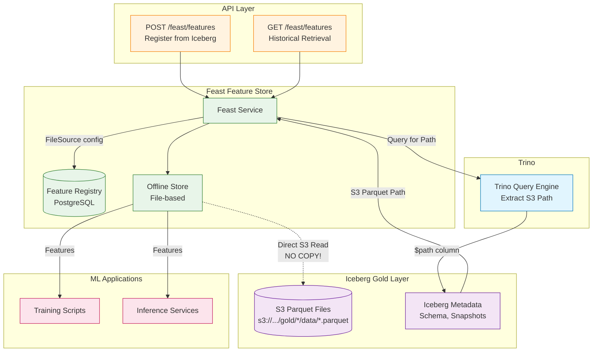

**Unique Design**: Direct S3 Parquet reads from Iceberg Gold layer

### 6. MLflow Platform

**Purpose**: ML experiment tracking, model registry, and serving

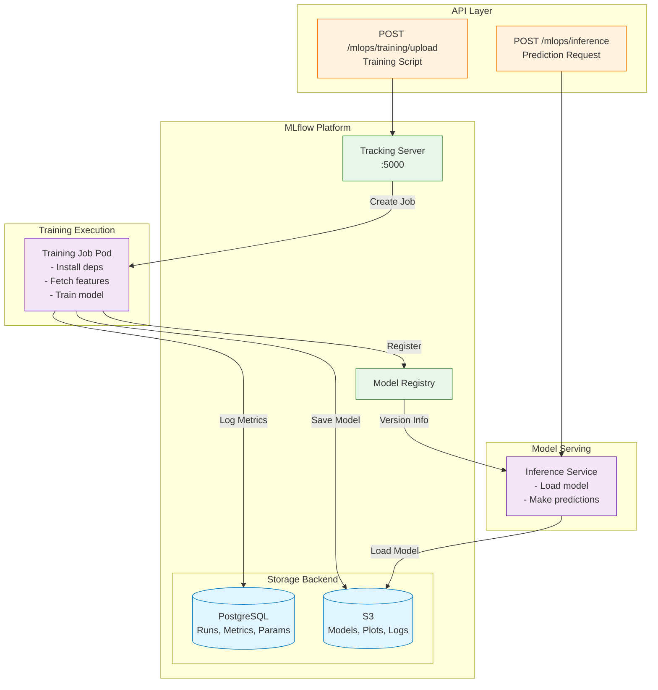

**Model Lifecycle**:

```
Training Script → MLflow Tracking → Model Registry → Model Serving
        │                 │                 │               │
        ↓                 ↓                 ↓               ↓
    Upload         Log metrics      Version model    Inference API
```

---

## Data Flow Architecture

### Medallion Architecture

The platform implements a **medallion architecture** with three data layers:

```mermaid
flowchart LR
    subgraph Bronze["🥉 Bronze Layer - Raw Data"]
        direction TB
        B1[Source: Airbyte Ingestion]
        B2[Format: Parquet as-is]
        B3[Schema: Source schema]
        B4[Retention: Indefinite]
        B1 --> B2 --> B3 --> B4
    end

    subgraph Silver["🥈 Silver Layer - Cleaned Data"]
        direction TB
        S1[Source: Spark Transformations]
        S2[Format: Parquet Snappy]
        S3[Operations: Cleansing, Validation]
        S4[Schema: Standardized]
        S1 --> S2 --> S3 --> S4
    end

    subgraph Gold["🥇 Gold Layer - Business Metrics"]
        direction TB
        G1[Source: DBT Transformations]
        G2[Format: Parquet Snappy]
        G3[Operations: Joins, Aggregations]
        G4[Schema: ML-ready Features]
        G1 --> G2 --> G3 --> G4
    end

    Bronze -->|Spark SQL<br/>Cleansing| Silver
    Silver -->|DBT + Trino<br/>Aggregation| Gold

    classDef bronzeStyle fill:#fbe9e7,stroke:#d84315
    classDef silverStyle fill:#e0f2f1,stroke:#00695c
    classDef goldStyle fill:#fff8e1,stroke:#f57f17

    class Bronze,B1,B2,B3,B4 bronzeStyle
    class Silver,S1,S2,S3,S4 silverStyle
    class Gold,G1,G2,G3,G4 goldStyle
```

### S3 Storage Structure

```
s3://airbytedestination1/iceberg/

├── bronze/                          # Raw data from sources
│   ├── customers/
│   │   ├── metadata/
│   │   │   ├── v1.metadata.json    # Iceberg table metadata
│   │   │   ├── v2.metadata.json
│   │   │   └── snap-{id}.avro      # Snapshot manifests
│   │   └── data/
│   │       ├── 00000-0-{uuid}.parquet
│   │       └── 00001-1-{uuid}.parquet
│   ├── transactions/
│   └── support_tickets/
│
├── silver/                          # Cleaned, validated data
│   ├── customers_cleaned/
│   │   ├── metadata/
│   │   └── data/
│   │       └── *.parquet
│   ├── transactions_cleaned/
│   └── support_tickets_cleaned/
│
└── gold/                            # ML-ready features
    ├── customer_metrics/
    │   ├── metadata/
    │   └── data/
    │       └── *.parquet           ← Feast reads directly from here!
    ├── product_analytics/
    └── churn_predictions/
```

---

## Iceberg Integration

### Why Iceberg?

1. **ACID Transactions** - Consistent reads and writes
2. **Time Travel** - Query data at any point in time
3. **Schema Evolution** - Add/modify columns without breaking queries
4. **Hidden Partitioning** - Automatic partition management
5. **Compaction** - Optimize small files automatically
6. **Metadata Efficiency** - Fast query planning

### Iceberg + Nessie Architecture


### Table Operations

```sql
-- Create table
CREATE TABLE iceberg.silver.customers (
  customer_id BIGINT,
  email VARCHAR,
  registration_date DATE
)
WITH (
  format = 'PARQUET',
  partitioning = ARRAY['registration_date']
);

-- Time travel query
SELECT * FROM iceberg.silver.customers
FOR TIMESTAMP AS OF TIMESTAMP '2025-11-01 00:00:00';

-- Schema evolution
ALTER TABLE iceberg.silver.customers
ADD COLUMN loyalty_tier VARCHAR;
```

---

## Feast Feature Store

### Zero-Duplication Architecture

```mermaid
flowchart TB
    subgraph Traditional["❌ Traditional Approach - Data Duplication"]
        I1[Iceberg Gold Layer<br/>S3 Parquet]
        E1[Export/ETL Job]
        L1[Local Parquet Copy]
        F1[Feast Feature Store]

        I1 -->|Copy Data| E1
        E1 -->|Write| L1
        L1 --> F1

        Problem1[❌ 2x Storage Cost<br/>❌ Sync Overhead<br/>❌ Consistency Issues]
    end

    subgraph Asgard["✅ Asgard Approach - Zero Duplication"]
        I2[Iceberg Gold Layer<br/>S3 Parquet]
        F2[Feast Feature Store<br/>FileSource]

        F2 -.Direct S3 Read<br/>NO COPY!.-> I2

        Benefits2[✅ Single Source of Truth<br/>✅ No Storage Duplication<br/>✅ Immediate Consistency]
    end

    classDef problemStyle fill:#ffebee,stroke:#c62828
    classDef goodStyle fill:#e8f5e9,stroke:#2e7d32

    class Traditional,I1,E1,L1,F1,Problem1 problemStyle
    class Asgard,I2,F2,Benefits2 goodStyle
```

### Implementation Details

**Method: `_get_iceberg_parquet_path()`**

```python
def _get_iceberg_parquet_path(self, table_fqn: str) -> str:
    """
    Query Trino to get the S3 Parquet file path from Iceberg table.
    Uses the $path system column to extract actual file locations.

    Returns: s3://bucket/iceberg/gold/{table_id}/data/*.parquet
    """
```

**Query Example**:

```sql
SELECT "$path" as file_path
FROM iceberg.gold.customer_aggregates
LIMIT 1
```

**Result**:

```
s3://airbytedestination1/iceberg/gold/efxgs5oersyezxnzydx4vsyou04jna6ti5/data/20251007_082213_00049_yb5wr-4e34e6e9.parquet
```

**Extracted Path**:

```
s3://airbytedestination1/iceberg/gold/efxgs5oersyezxnzydx4vsyou04jna6ti5/data/*.parquet
```

### Feast FileSource Configuration

```python
FileSource(
    name="customer_features_source",
    path="s3://airbytedestination1/iceberg/gold/{table_id}/data/*.parquet",
    timestamp_field="event_timestamp",
)
```

### Feature Registration Flow

```mermaid
sequenceDiagram
    participant User
    participant API as FastAPI
    participant Feast as Feast Service
    participant Trino as Trino
    participant Iceberg as Iceberg Metadata
    participant S3 as S3 Parquet Files

    User->>API: POST /feast/features<br/>{table: "customer_metrics"}
    API->>Feast: create_feature_view()

    Note over Feast: 1. Validate Table
    Feast->>Trino: SELECT * FROM iceberg.gold.customer_metrics LIMIT 1
    Trino->>Iceberg: Get table metadata
    Iceberg-->>Trino: Table exists, schema returned
    Trino-->>Feast: Table valid ✓

    Note over Feast: 2. Get S3 Path
    Feast->>Trino: SELECT "$path" FROM table LIMIT 1
    Trino->>Iceberg: Get file locations
    Iceberg->>S3: Resolve Parquet paths
    S3-->>Iceberg: File paths
    Iceberg-->>Trino: s3://.../data/*.parquet
    Trino-->>Feast: S3 Parquet path

    Note over Feast: 3. Register Feature View
    Feast->>Feast: Create FileSource(path=s3://...)
    Feast->>Feast: Register FeatureView

    Feast-->>API: Feature view registered ✓
    API-->>User: {status: "success", features: [...]}
```

### Key Benefits

| Aspect            | Old Approach                | Asgard Approach          |
| ----------------- | --------------------------- | ------------------------ |
| **Data Storage**  | Duplicate (Iceberg + Local) | Single (Iceberg S3 only) |
| **Sync Required** | Yes (Trino → Local)         | No (direct S3 read)      |
| **Latency**       | Higher (copy overhead)      | Lower (direct access)    |
| **Storage Cost**  | 2x (Iceberg + Local)        | 1x (Iceberg only)        |
| **Consistency**   | Eventual (after sync)       | Immediate (same files)   |
| **Scalability**   | Limited by local disk       | Unlimited (S3)           |
| **Complexity**    | Higher (sync logic)         | Lower (direct read)      |

---

## MLflow Integration

### Training Workflow

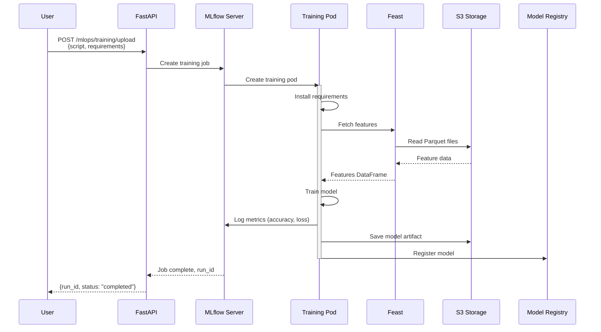

### Model Versioning

```mermaid
flowchart TB
    subgraph Models["customer_churn_predictor"]
        direction TB

        subgraph V1["Version 1 - Development"]
            V1_Metrics[Accuracy: 0.85<br/>F1: 0.82<br/>Status: Development]
            V1_Artifacts[model.pkl<br/>feature_importance.png<br/>requirements.txt]
        end

        subgraph V2["Version 2 - Staging"]
            V2_Metrics[Accuracy: 0.87<br/>F1: 0.85<br/>Status: Staging]
            V2_Artifacts[model.pkl<br/>confusion_matrix.png<br/>requirements.txt]
        end

        subgraph V3["Version 3 - Production ⭐"]
            V3_Metrics[Accuracy: 0.89<br/>F1: 0.87<br/>Status: Production]
            V3_Artifacts[model.pkl<br/>roc_curve.png<br/>requirements.txt]
        end
    end

    V1 -->|Promote| V2
    V2 -->|Promote| V3

    classDef devStyle fill:#e3f2fd,stroke:#1565c0
    classDef stagingStyle fill:#fff3e0,stroke:#ef6c00
    classDef prodStyle fill:#e8f5e9,stroke:#2e7d32

    class V1,V1_Metrics,V1_Artifacts devStyle
    class V2,V2_Metrics,V2_Artifacts stagingStyle
    class V3,V3_Metrics,V3_Artifacts prodStyle
```

---

## Sequence Diagrams

### Complete ML Workflow


### Spark Job Execution


---

## Network & Storage Architecture

### Kubernetes Service Mesh


### Service Communication

```
asgard-app Pod Communication:
├── http://mlflow-service:5000           (MLflow API)
├── http://trino:8080                    (Trino queries)
├── postgresql://postgres:5432/feast     (Feast registry)
├── postgresql://postgres:5432/mlflow    (MLflow metadata)
├── http://airbyte-server:8001           (Airbyte API)
└── s3://airbytedestination1             (S3 storage)
```

---

## Security & Performance

### Security Architecture

```mermaid
flowchart TB
    subgraph Security["Security Layers"]
        subgraph K8s["Kubernetes RBAC"]
            SA[ServiceAccounts]
            Roles[Roles & RoleBindings]
            NetPol[NetworkPolicies]
        end

        subgraph AWS["AWS IAM"]
            IAM[IAM Roles]
            Keys[Access Keys<br/>in K8s Secrets]
            IRSA[IAM Roles for<br/>Service Accounts]
        end

        subgraph App["Application Level"]
            Validation[Input Validation<br/>Pydantic]
            Throttle[Rate Limiting]
            Auth[API Key Auth<br/>Optional]
        end

        subgraph Data["Data Security"]
            EncryptRest[S3 Encryption at Rest<br/>SSE-S3/SSE-KMS]
            EncryptTransit[TLS in Transit]
            Access[S3 IAM Policies]
        end
    end

    K8s --> AWS
    AWS --> App
    App --> Data

    classDef k8sStyle fill:#e3f2fd,stroke:#1565c0
    classDef awsStyle fill:#fff3e0,stroke:#ef6c00
    classDef appStyle fill:#e8f5e9,stroke:#2e7d32
    classDef dataStyle fill:#f3e5f5,stroke:#6a1b9a

    class K8s,SA,Roles,NetPol k8sStyle
    class AWS,IAM,Keys,IRSA awsStyle
    class App,Validation,Throttle,Auth appStyle
    class Data,EncryptRest,EncryptTransit,Access dataStyle
```

### Horizontal Scaling


### Performance Optimizations

1. **Iceberg Compaction**: Merge small files automatically
2. **Spark Caching**: In-memory data for iterative processing
3. **Trino Query Optimization**: Predicate pushdown, partition pruning
4. **S3 Transfer Acceleration**: Faster uploads/downloads
5. **Connection Pooling**: Reuse database connections
6. **Parquet Columnar Format**: Optimized for analytics
7. **Partition Pruning**: Reduce data scanned
8. **Metadata Caching**: Cache Feast feature definitions

---

## Reference Tables

### Component Port Reference

| Component         | Internal Port | External Port       | Protocol   |
| ----------------- | ------------- | ------------------- | ---------- |
| Asgard API        | 80            | 8000 (port-forward) | HTTP       |
| MLflow Server     | 5000          | 5000 (port-forward) | HTTP       |
| PostgreSQL        | 5432          | -                   | PostgreSQL |
| Trino Coordinator | 8080          | -                   | HTTP       |
| Airbyte Server    | 8001          | 8001 (port-forward) | HTTP       |
| Spark Driver      | 4040          | 4040 (port-forward) | HTTP       |
| Spark UI          | 18080         | -                   | HTTP       |

### Iceberg Table Naming Convention

| Layer  | Namespace        | Table Pattern                | Example                            |
| ------ | ---------------- | ---------------------------- | ---------------------------------- |
| Bronze | `iceberg.bronze` | `{source_table}`             | `iceberg.bronze.customers`         |
| Silver | `iceberg.silver` | `{source_table}_cleaned`     | `iceberg.silver.customers_cleaned` |
| Gold   | `iceberg.gold`   | `{business_entity}_{metric}` | `iceberg.gold.customer_metrics`    |

### API Endpoint Summary

| Endpoint                 | Method | Purpose                | Response Time |
| ------------------------ | ------ | ---------------------- | ------------- |
| `/health`                | GET    | Platform health        | <50ms         |
| `/datasource`            | POST   | Create data source     | ~1s           |
| `/ingestion`             | POST   | Start sync job         | ~1s           |
| `/spark/transform`       | POST   | Submit Spark job       | ~2s           |
| `/dbt/transform`         | POST   | Run DBT model          | ~1s           |
| `/feast/features`        | POST   | Register features      | ~500ms        |
| `/mlops/training/upload` | POST   | Upload training script | ~2s           |
| `/mlops/inference`       | POST   | Make predictions       | <100ms        |

### Data Layer Comparison

| Aspect        | Bronze           | Silver             | Gold                 |
| ------------- | ---------------- | ------------------ | -------------------- |
| **Source**    | External systems | Bronze             | Silver               |
| **Quality**   | Raw, as-is       | Cleaned, validated | Aggregated, enriched |
| **Schema**    | Original         | Standardized       | ML-ready             |
| **Size**      | Largest          | Medium             | Smallest             |
| **Updates**   | Append-only      | Overwrite/append   | Usually overwrite    |
| **Consumers** | Spark            | DBT, analysts      | Feast, ML models     |
| **Retention** | Indefinite       | 6-12 months        | 3-6 months           |

### Typical Processing Times

| Operation            | Volume    | Time      | Notes              |
| -------------------- | --------- | --------- | ------------------ |
| Airbyte Sync         | 100K rows | 10-15 min | Depends on network |
| Spark Cleansing      | 100K rows | 5-10 min  | 2 executors        |
| DBT Aggregation      | 100K rows | 3-5 min   | Simple joins       |
| Feature Registration | -         | <1 min    | Metadata only      |
| Model Training       | 100K rows | 15-30 min | Random Forest      |
| Batch Inference      | 100K rows | 5-10 min  | Depends on model   |

---

## Design Decisions

### Why FastAPI?

- **Performance**: Async support for high throughput
- **Type Safety**: Pydantic validation
- **Auto Documentation**: OpenAPI/Swagger generation
- **Modern Python**: Python 3.11+ features

### Why Iceberg over Delta/Hudi?

- **Vendor Neutral**: Not tied to Spark/Databricks
- **Nessie Integration**: Git-like versioning
- **Hidden Partitioning**: Simplifies queries
- **Strong Community**: Apache foundation

### Why Feast for Features?

- **Simplicity**: Easy to define features
- **Flexibility**: Multiple offline/online stores
- **ML Framework Agnostic**: Works with any ML library
- **Direct S3 Read**: No data duplication

### Why Kubernetes?

- **Cloud Agnostic**: Run anywhere (EKS, GKE, on-prem)
- **Auto Scaling**: HPA, VPA, cluster autoscaler
- **Service Discovery**: Built-in DNS
- **Resource Management**: CPU/memory limits and requests

---

## Summary

### Key Architectural Highlights

1. ✅ **Unified API** - Single FastAPI gateway for all operations
2. ✅ **Zero Duplication** - Feast reads directly from Iceberg (no data copy)
3. ✅ **Medallion Architecture** - Bronze → Silver → Gold data layers
4. ✅ **Kubernetes Native** - Cloud-agnostic, horizontally scalable
5. ✅ **Open Source Stack** - No vendor lock-in
6. ✅ **Production Ready** - Battle-tested components
7. ✅ **Git-like Data Versioning** - Nessie catalog for data branches/tags
8. ✅ **ACID Transactions** - Iceberg ensures data consistency

### Platform Benefits

- **Single Source of Truth**: All features read from same Iceberg tables
- **Cost Efficient**: No duplicate storage, minimal data movement
- **Scalable**: S3 storage, Kubernetes orchestration, dynamic scaling
- **Developer Friendly**: REST API, auto-documentation, type safety
- **Production Grade**: Monitoring, logging, error handling built-in

### Next Steps

- **Understand workflows**: [USE_CASE_GUIDE.md](USE_CASE_GUIDE.md)
- **Test APIs**: [API_TESTING_GUIDE.md](API_TESTING_GUIDE.md)
- **Debug issues**: [DEBUGGING_GUIDE.md](DEBUGGING_GUIDE.md)
- **Setup environment**: [ONBOARDING_SETUP.md](ONBOARDING_SETUP.md)
- **MLOps operations**: [MLOPS_QUICK_REFERENCE.md](MLOPS_QUICK_REFERENCE.md)

---

**Document Status**: ✅ Complete and Ready  
**Diagrams**: ✅ All rendered with Mermaid  
**Last Review**: November 24, 2025
