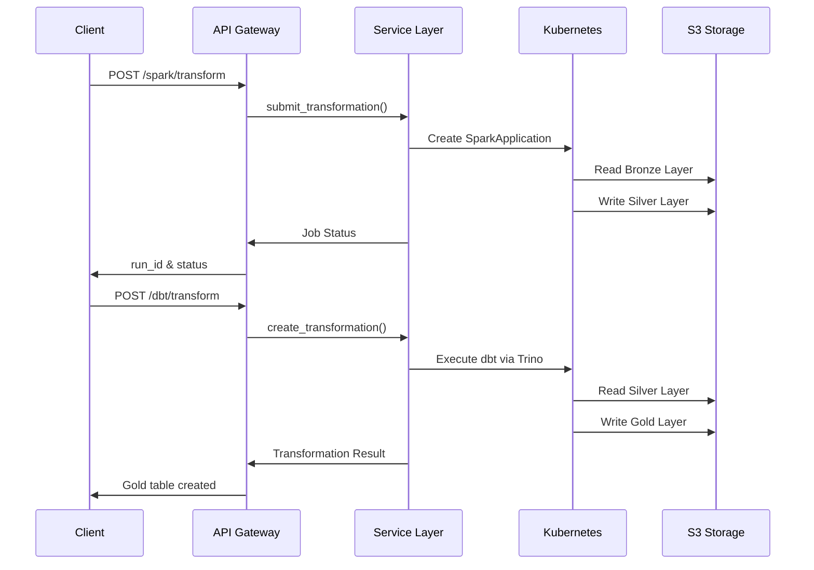

# Asgard Data Platform - Complete Documentation

## Table of Contents

1. [Overview](#overview)
2. [Architecture](#architecture)
3. [Getting Started](#getting-started)
4. [API Documentation](#api-documentation)
5. [Data Transformation APIs](#data-transformation-apis)
6. [Data Products](#data-products)
7. [Deployment Guide](#deployment-guide)
8. [Troubleshooting](#troubleshooting)
9. [Best Practices](#best-practices)
10. [Configuration Reference](#configuration-reference)

---

## Overview

### What is Asgard?

**Asgard Data Platform** is a comprehensive, cloud-native data platform that provides unified REST APIs for end-to-end data operations:

- **Data Ingestion**: Via Airbyte for connecting to 300+ data sources
- **Data Transformation**: Using Spark on Kubernetes and dbt for SQL transformations
- **Data Products**: Framework for creating and managing business-ready analytics tables
- **Data Lakehouse**: Bronze/Silver/Gold layer architecture on S3 with Iceberg tables

### Key Features

✅ **Unified REST APIs**: Single API gateway for all data operations  
✅ **Cloud-Native**: Runs on Kubernetes with auto-scaling  
✅ **Modular Architecture**: Pluggable components and services  
✅ **Multiple Processing Engines**: Spark for distributed processing, dbt for SQL transformations  
✅ **Modern Data Stack**: Iceberg tables, Trino query engine, Nessie catalog  
✅ **Data Governance**: Built-in metadata management and lineage tracking

### Technology Stack

| Layer                  | Technology                    |
| ---------------------- | ----------------------------- |
| **API Gateway**        | FastAPI (Python 3.11+)        |
| **Orchestration**      | Kubernetes, Helm              |
| **Data Ingestion**     | Airbyte                       |
| **Batch Processing**   | Apache Spark 3.5.0            |
| **SQL Transformation** | dbt Core, Trino               |
| **Storage**            | S3-compatible (AWS S3, MinIO) |
| **Table Format**       | Apache Iceberg                |
| **Catalog**            | Nessie (Git-like versioning)  |
| **Package Manager**    | uv                            |

---

## Architecture

### System Architecture

```
┌─────────────────────────────────────────────────────────────┐
│                     CLIENT APPLICATIONS                      │
│          REST Clients │ Web Apps │ CLI Tools                │
└──────────────────────────┬──────────────────────────────────┘
                           │
                           ▼
         ┌─────────────────────────────────┐
         │      ASGARD API GATEWAY         │
         │         (FastAPI)               │
         │         Port 8000               │
         └────────────┬────────────────────┘
                      │
        ┌─────────────┴─────────────┐
        │                           │
        ▼                           ▼
┌───────────────┐          ┌────────────────────┐
│ Airbyte API   │          │ Transformation APIs│
│   Service     │          │  - Spark API       │
│               │          │  - DBT API         │
│ - Sources     │          │  - Data Products   │
│ - Destinations│          └─────────┬──────────┘
│ - Connections │                    │
└───────┬───────┘                    │
        │                            │
        ▼                            ▼
┌────────────────┐          ┌────────────────────┐
│  Airbyte       │          │   Kubernetes       │
│  Server        │          │   - SparkOperator  │
│  Port 8001     │          │   - Trino          │
└───────┬────────┘          │   - Nessie         │
        │                   └─────────┬──────────┘
        │                             │
        └─────────────┬───────────────┘
                      │
                      ▼
         ┌────────────────────────┐
         │   S3 STORAGE LAYERS    │
         │                        │
         │  Bronze → Silver → Gold│
         │  (Iceberg Tables)      │
         └────────────────────────┘
```

### Data Flow Architecture

```
┌─────────────┐
│ Data Sources│  (PostgreSQL, MySQL, MongoDB, APIs, Files)
└──────┬──────┘
       │
       ▼
┌─────────────┐
│   Airbyte   │  → Ingestion Layer
└──────┬──────┘
       │
       ▼
┌──────────────────────────────────────────────────┐
│           BRONZE LAYER (Raw Data)                │
│  - Location: s3://bucket/bronze/                 │
│  - Format: Parquet, JSON, CSV (as ingested)      │
│  - Purpose: Raw, unmodified data from sources    │
└────────────────────┬─────────────────────────────┘
                     │
                     ▼
         ┌───────────────────────┐
         │  SPARK TRANSFORMATION │  → /api/v1/spark/transform
         │  - Distributed ETL    │
         │  - Data Cleaning      │
         │  - Standardization    │
         └───────────┬───────────┘
                     │
                     ▼
┌──────────────────────────────────────────────────┐
│        SILVER LAYER (Processed Data)             │
│  - Location: s3://bucket/silver/                 │
│  - Format: Parquet (Iceberg Tables)              │
│  - Purpose: Cleaned, validated data              │
└────────────────────┬─────────────────────────────┘
                     │
                     ▼
         ┌───────────────────────┐
         │  DBT TRANSFORMATION   │  → /api/v1/dbt/transform
         │  - Business Logic     │
         │  - Aggregations       │
         │  - Metrics            │
         └───────────┬───────────┘
                     │
                     ▼
┌──────────────────────────────────────────────────┐
│         GOLD LAYER (Analytics-Ready)             │
│  - Location: s3://bucket/gold/                   │
│  - Format: Iceberg Tables (ACID)                 │
│  - Purpose: Business metrics, reports, ML data   │
└────────────────────┬─────────────────────────────┘
                     │
                     ▼
            ┌────────────────┐
            │  CONSUMPTION   │
            │  - BI Tools    │
            │  - Analytics   │
            │  - ML Pipelines│
            └────────────────┘
```

### Component Interaction



---

## Getting Started

### Prerequisites

- **Python**: 3.11 or higher
- **Package Manager**: [uv](https://docs.astral.sh/uv/) (recommended) or pip
- **Kubernetes**: v1.24+ cluster with kubectl configured
- **Airbyte**: Running instance (for data ingestion)
- **Storage**: S3-compatible storage (AWS S3 or MinIO)
- **Optional**: Docker for local development

### Installation

#### 1. Clone the Repository

```bash
git clone https://github.com/snowcell-cloud/asgard-dev.git
cd asgard-dev
```

#### 2. Install Dependencies

Using **uv** (recommended):

```bash
# Install uv if not already installed
curl -LsSf https://astral.sh/uv/install.sh | sh

# Install dependencies
uv sync
```

Using **pip**:

```bash
python -m venv venv
source venv/bin/activate  # On Windows: venv\Scripts\activate
pip install -r requirements.txt
```

#### 3. Configure Environment

```bash
# Copy example configuration
cp .env.example .env

# Edit configuration
nano .env
```

**Required Environment Variables**:

```bash
# Airbyte Configuration
AIRBYTE_BASE_URL=http://airbyte.airbyte.svc.cluster.local:8001/api/public/v1

# Spark Configuration
SPARK_NAMESPACE=spark-operator
SPARK_IMAGE=your-registry/spark-custom:latest
SPARK_SERVICE_ACCOUNT=spark-sa

# Trino/DBT Configuration
TRINO_HOST=trino.data-platform.svc.cluster.local
TRINO_PORT=8080
TRINO_USER=dbt
TRINO_CATALOG=iceberg

# Schemas
SILVER_SCHEMA=silver
GOLD_SCHEMA=gold

# S3 Configuration
S3_BUCKET=your-data-lake-bucket
AWS_REGION=us-east-1
AWS_ACCESS_KEY_ID=your-key-id
AWS_SECRET_ACCESS_KEY=your-secret-key

# Nessie Configuration
NESSIE_URI=http://nessie.data-platform.svc.cluster.local:19120/api/v1
NESSIE_REF=main

# DBT Configuration
DBT_PROJECT_DIR=/tmp/dbt_projects
```

#### 4. Run Locally

```bash
# Using uvicorn directly
uvicorn app.main:app --host 0.0.0.0 --port 8000 --reload

# Using uv
uv run uvicorn app.main:app --host 0.0.0.0 --port 8000 --reload
```

#### 5. Verify Installation

```bash
# Health check
curl http://localhost:8000/health

# API documentation
open http://localhost:8000/docs
```

### Quick Test

```bash
# Test Spark transformation
curl -X POST http://localhost:8000/api/v1/spark/transform \
  -H "Content-Type: application/json" \
  -d '{
    "sql": "SELECT 1 as test_col, CURRENT_TIMESTAMP as created_at"
  }'

# Test DBT transformation
curl -X POST http://localhost:8000/api/v1/dbt/transform \
  -H "Content-Type: application/json" \
  -d '{
    "name": "test_transformation",
    "sql_query": "SELECT 1 as id, CURRENT_TIMESTAMP as created_at",
    "materialization": "table"
  }'
```

---

## API Documentation

### API Structure

All APIs follow RESTful conventions and are versioned under `/api/v1/`:

| Base Path                 | Description                 |
| ------------------------- | --------------------------- |
| `/health`                 | Health check endpoint       |
| `/api/v1/airbyte/*`       | Airbyte data ingestion APIs |
| `/api/v1/spark/*`         | Spark transformation APIs   |
| `/api/v1/dbt/*`           | DBT transformation APIs     |
| `/api/v1/data-products/*` | Data products framework     |

### Interactive Documentation

- **Swagger UI**: http://localhost:8000/docs
- **ReDoc**: http://localhost:8000/redoc
- **OpenAPI Spec**: http://localhost:8000/openapi.json

### Common Response Codes

| Code | Meaning          | Description                   |
| ---- | ---------------- | ----------------------------- |
| 200  | OK               | Request successful            |
| 201  | Created          | Resource created successfully |
| 400  | Bad Request      | Invalid request parameters    |
| 404  | Not Found        | Resource not found            |
| 422  | Validation Error | Request validation failed     |
| 500  | Server Error     | Internal server error         |

### Authentication

Currently, the API does not require authentication. For production deployment:

1. Add API key authentication
2. Implement OAuth2/JWT tokens
3. Use Kubernetes NetworkPolicies for internal services
4. Enable TLS/HTTPS

---

## Data Transformation APIs

For comprehensive transformation API documentation, see: **[TRANSFORMATION_APIs_DOCUMENTATION.md](./TRANSFORMATION_APIs_DOCUMENTATION.md)**

### Quick Reference

#### Spark Transformation API

**Purpose**: Bronze → Silver layer transformations using distributed Spark

```bash
# Submit transformation
POST /api/v1/spark/transform
{
  "sql": "SELECT * FROM parquet.`source` WHERE date >= '2024-01-01'",
  "executor_instances": 2,
  "executor_memory": "2g"
}

# Get status
GET /api/v1/spark/transform/{run_id}/status

# Get logs
GET /api/v1/spark/transform/{run_id}/logs
```

#### DBT Transformation API

**Purpose**: Silver → Gold layer transformations using SQL

```bash
# Create transformation
POST /api/v1/dbt/transform
{
  "name": "customer_metrics",
  "sql_query": "SELECT customer_id, COUNT(*) as orders FROM silver.orders GROUP BY customer_id",
  "materialization": "table",
  "tags": ["customer", "metrics"]
}

# List transformations
GET /api/v1/dbt/transformations?page=1&page_size=20

# Validate SQL
POST /api/v1/dbt/validate-sql
{
  "sql_query": "SELECT * FROM silver.customers"
}
```

---

## Data Products

### Overview

Data Products provide a framework for creating and managing business-ready analytics tables in the Gold layer with metadata, lineage tracking, and governance.

### Key Features

- **Metadata Registry**: Track owners, consumers, update frequency
- **Automatic Gold Layer Tables**: Creates Iceberg tables in gold schema
- **Lineage Tracking**: Upstream sources and downstream consumers
- **Data Enrichment**: Automatic metadata columns
- **API-Driven**: Create and manage via REST API

### API Endpoints

#### 1. Create Data Product

```bash
POST /api/v1/data-products/
```

**Request**:

```json
{
  "name": "Customer 360 Analytics",
  "description": "Comprehensive customer metrics and insights",
  "data_product_type": "CUSTOMER_360",
  "owner": "analytics-team",
  "consumers": ["bi_team", "ml_team"],
  "update_frequency": "daily",
  "tags": ["customer", "analytics", "kpi"],
  "sql_query": "SELECT customer_id, SUM(revenue) as lifetime_value FROM silver.transactions GROUP BY customer_id"
}
```

**Response**:

```json
{
  "id": "550e8400-e29b-41d4-a716-446655440000",
  "name": "Customer 360 Analytics",
  "table_name": "dp_customer_360_analytics",
  "schema_name": "gold",
  "status": "created",
  "created_at": "2024-10-07T10:30:00Z"
}
```

#### 2. List Data Products

```bash
GET /api/v1/data-products/
```

#### 3. Get Data Product Details

```bash
GET /api/v1/data-products/{id}
```

#### 4. Update Data Product

```bash
PUT /api/v1/data-products/{id}
```

#### 5. Run Transformation

```bash
POST /api/v1/data-products/{id}/run
```

Executes the data product transformation and creates/updates the Gold layer table.

#### 6. Get Lineage

```bash
GET /api/v1/data-products/{id}/lineage
```

Returns upstream sources and downstream consumers.

#### 7. Get Statistics

```bash
GET /api/v1/data-products/{id}/stats
```

Returns table statistics (row count, size, last updated).

#### 8. Delete Data Product

```bash
DELETE /api/v1/data-products/{id}
```

### Data Product Types

- `CUSTOMER_360`: Customer analytics
- `PRODUCT_ANALYTICS`: Product metrics
- `FINANCIAL_REPORTING`: Financial data
- `OPERATIONAL_METRICS`: Operational KPIs
- `MARKETING_ANALYTICS`: Marketing insights
- `CUSTOM`: Custom data products

---

## Deployment Guide

### Kubernetes Deployment

#### Prerequisites

1. **Kubernetes Cluster**: v1.24+
2. **kubectl**: Configured to access your cluster
3. **Helm**: v3.0+
4. **ECR Access**: AWS ECR credentials (or other registry)

#### Step 1: Build Docker Image

```bash
# Build the image
docker build -t 637423187518.dkr.ecr.eu-north-1.amazonaws.com/asgard:latest .

# Authenticate to ECR
aws ecr get-login-password --region eu-north-1 | \
  docker login --username AWS --password-stdin 637423187518.dkr.ecr.eu-north-1.amazonaws.com

# Push the image
docker push 637423187518.dkr.ecr.eu-north-1.amazonaws.com/asgard:latest
```

#### Step 2: Configure Secrets

```bash
# Create namespace
kubectl create namespace asgard

# Create S3 credentials secret
kubectl create secret generic s3-credentials \
  -n asgard \
  --from-literal=AWS_ACCESS_KEY_ID=your-key-id \
  --from-literal=AWS_SECRET_ACCESS_KEY=your-secret-key

# Create ECR pull secret
kubectl create secret docker-registry ecr-credentials \
  -n asgard \
  --docker-server=637423187518.dkr.ecr.eu-north-1.amazonaws.com \
  --docker-username=AWS \
  --docker-password=$(aws ecr get-login-password --region eu-north-1)
```

#### Step 3: Create Required Schemas

```bash
# Run schema creation script
chmod +x script/create-schemas.sh
./script/create-schemas.sh
```

Or manually:

```bash
# Create silver schema
kubectl run -n asgard create-silver --image=curlimages/curl --rm -i --restart=Never -- \
  curl -X POST 'http://trino.data-platform.svc.cluster.local:8080/v1/statement' \
    -H 'X-Trino-User: dbt' \
    -H 'X-Trino-Catalog: iceberg' \
    -d 'CREATE SCHEMA IF NOT EXISTS iceberg.silver'

# Create gold schema
kubectl run -n asgard create-gold --image=curlimages/curl --rm -i --restart=Never -- \
  curl -X POST 'http://trino.data-platform.svc.cluster.local:8080/v1/statement' \
    -H 'X-Trino-User: dbt' \
    -H 'X-Trino-Catalog: iceberg' \
    -d 'CREATE SCHEMA IF NOT EXISTS iceberg.gold'
```

#### Step 4: Deploy with Helm

```bash
# Deploy using Helm
helm upgrade --install asgard ./helmchart \
  -n asgard \
  --set image.repository=637423187518.dkr.ecr.eu-north-1.amazonaws.com/asgard \
  --set image.tag=latest \
  --set service.type=LoadBalancer \
  --wait

# Check deployment status
kubectl get pods -n asgard
kubectl get svc -n asgard

# View logs
kubectl logs -n asgard -l app=asgard-app --tail=100 -f
```

#### Step 5: Configure Ingress (Optional)

```bash
# Apply ingress
kubectl apply -f k8s/production-deployment.yaml

# Get external IP
kubectl get ingress -n asgard
```

### Configuration Files

#### helmchart/values.yaml

```yaml
replicaCount: 2

image:
  repository: 637423187518.dkr.ecr.eu-north-1.amazonaws.com/asgard
  tag: latest
  pullPolicy: Always

service:
  type: LoadBalancer
  port: 80
  targetPort: 8000

env:
  - name: AIRBYTE_BASE_URL
    value: "http://airbyte.airbyte.svc.cluster.local:8001/api/public/v1"
  - name: TRINO_HOST
    value: "trino.data-platform.svc.cluster.local"
  - name: TRINO_PORT
    value: "8080"
  - name: SPARK_NAMESPACE
    value: "spark-operator"
  - name: DBT_PROJECT_DIR
    value: "/tmp/dbt_projects"

resources:
  limits:
    cpu: 2000m
    memory: 2Gi
  requests:
    cpu: 500m
    memory: 512Mi
```

### Production Deployment Checklist

- [ ] Build and push Docker image to registry
- [ ] Create Kubernetes namespace
- [ ] Configure secrets (S3, ECR, etc.)
- [ ] Create database schemas (silver, gold)
- [ ] Deploy with Helm
- [ ] Verify pod status
- [ ] Test API endpoints
- [ ] Configure monitoring and logging
- [ ] Set up ingress/load balancer
- [ ] Configure DNS
- [ ] Enable HTTPS/TLS
- [ ] Set up backup and disaster recovery

---

## Troubleshooting

### Common Issues

#### 1. Trino Connection Failed

**Error**: `dbt run failed: INFO:trino.client:failed after 3 attempts`

**Solutions**:

```bash
# Verify Trino service exists
kubectl get svc -n data-platform | grep trino

# Test DNS resolution from Asgard pod
POD=$(kubectl get pods -n asgard -l app=asgard-app -o jsonpath='{.items[0].metadata.name}')
kubectl exec -n asgard $POD -- nslookup trino.data-platform.svc.cluster.local

# Test HTTP connection
kubectl exec -n asgard $POD -- curl -v http://trino.data-platform.svc.cluster.local:8080/v1/info

# Check Trino logs
kubectl logs -n data-platform -l app=trino
```

**Common causes**:

- Wrong service name or namespace
- Network policies blocking traffic
- Trino not running or unhealthy
- Firewall/security group rules

#### 2. Schema Not Found

**Error**: `Schema 'silver' does not exist`

**Solution**:

```bash
# Create schemas using script
./script/create-schemas.sh

# Or manually via Trino
kubectl exec -n data-platform trino-coordinator-0 -- \
  trino --catalog iceberg --execute "CREATE SCHEMA IF NOT EXISTS iceberg.silver"

kubectl exec -n data-platform trino-coordinator-0 -- \
  trino --catalog iceberg --execute "CREATE SCHEMA IF NOT EXISTS iceberg.gold"
```

#### 3. S3 Access Denied

**Error**: `Access Denied` when reading/writing S3

**Solutions**:

```bash
# Verify S3 credentials secret
kubectl get secret s3-credentials -n asgard -o yaml

# Update credentials
kubectl create secret generic s3-credentials \
  -n asgard \
  --from-literal=AWS_ACCESS_KEY_ID=new-key \
  --from-literal=AWS_SECRET_ACCESS_KEY=new-secret \
  --dry-run=client -o yaml | kubectl apply -f -

# Restart pods to pick up new credentials
kubectl rollout restart deployment asgard-app -n asgard
```

**Check IAM permissions**:

```json
{
  "Effect": "Allow",
  "Action": [
    "s3:GetObject",
    "s3:PutObject",
    "s3:ListBucket",
    "s3:DeleteObject"
  ],
  "Resource": ["arn:aws:s3:::your-bucket/*", "arn:aws:s3:::your-bucket"]
}
```

#### 4. Spark Job Stuck

**Error**: SparkApplication stuck in SUBMITTED state

**Debug steps**:

```bash
# Check SparkApplication status
kubectl get sparkapplications -n spark-operator

# Describe SparkApplication
kubectl describe sparkapplication sql-exec-{run_id} -n spark-operator

# Check SparkOperator logs
kubectl logs -n spark-operator -l app=spark-operator

# Check driver pod
kubectl get pods -n spark-operator | grep driver
kubectl logs -n spark-operator sql-exec-{run_id}-driver

# Check events
kubectl get events -n spark-operator --sort-by='.lastTimestamp'
```

**Common causes**:

- Insufficient cluster resources
- Image pull errors
- Service account permissions
- S3 credentials missing

#### 5. Permission Denied Writing Files

**Error**: `[Errno 13] Permission denied: '/home/hac'`

**Solution**:

Update DBT_PROJECT_DIR to writable location:

```bash
# In deployment or .env
DBT_PROJECT_DIR=/tmp/dbt_projects

# Or in Helm values
env:
  - name: DBT_PROJECT_DIR
    value: /tmp/dbt_projects
```

#### 6. Module Not Found (dbt)

**Error**: `ModuleNotFoundError: No module named 'dbt'`

**Solution**:

Ensure dbt is run with proper environment:

```bash
# Use uv to run dbt
uv run dbt run --select model_name

# Or ensure dbt is installed
uv add dbt-core dbt-trino
```

### Debug Commands

```bash
# View pod logs
kubectl logs -n asgard -l app=asgard-app --tail=100 -f

# Execute command in pod
kubectl exec -n asgard -it <pod-name> -- /bin/bash

# Port forward for local testing
kubectl port-forward -n asgard svc/asgard-service 8000:80

# Check resource usage
kubectl top pods -n asgard

# View all resources
kubectl get all -n asgard

# Describe service
kubectl describe svc -n asgard asgard-service

# Check ConfigMaps
kubectl get configmap -n asgard

# View secrets (base64 encoded)
kubectl get secret -n asgard s3-credentials -o yaml
```

### Logging and Monitoring

#### Application Logs

```bash
# Stream logs
kubectl logs -n asgard -l app=asgard-app -f

# Last 1000 lines
kubectl logs -n asgard -l app=asgard-app --tail=1000

# Logs from specific container
kubectl logs -n asgard <pod-name> -c asgard-container
```

#### Spark Job Logs

```bash
# Driver logs
kubectl logs -n spark-operator sql-exec-{run_id}-driver

# Executor logs
kubectl logs -n spark-operator sql-exec-{run_id}-exec-1
```

#### Trino Query Logs

```bash
# Trino coordinator logs
kubectl logs -n data-platform -l app=trino -l component=coordinator

# Query history
kubectl exec -n data-platform trino-coordinator-0 -- \
  trino --execute "SELECT * FROM system.runtime.queries ORDER BY created DESC LIMIT 10"
```

---

## Best Practices

### Development

#### 1. Code Organization

```
app/
├── __init__.py
├── main.py              # FastAPI app initialization
├── config.py            # Configuration management
├── airbyte/            # Airbyte integration
│   ├── router.py       # API routes
│   ├── service.py      # Business logic
│   ├── client.py       # External client
│   └── schemas.py      # Pydantic models
├── data_transformation/ # Spark transformations
├── dbt_transformations/ # DBT transformations
└── data_products/       # Data products framework
```

#### 2. Error Handling

```python
from fastapi import HTTPException

try:
    result = await service.process_data()
    return result
except ValueError as e:
    raise HTTPException(status_code=400, detail=str(e))
except Exception as e:
    logger.error(f"Unexpected error: {e}")
    raise HTTPException(status_code=500, detail="Internal server error")
```

#### 3. Logging

```python
import logging

logger = logging.getLogger(__name__)

# Log levels
logger.debug("Detailed information for debugging")
logger.info("General information")
logger.warning("Warning message")
logger.error("Error occurred")
logger.critical("Critical error")
```

### Data Transformation

#### 1. Resource Sizing

| Dataset Size | Executor Instances | Executor Cores | Executor Memory |
| ------------ | ------------------ | -------------- | --------------- |
| < 1 GB       | 1                  | 1              | 512m            |
| 1-10 GB      | 2                  | 2              | 2g              |
| 10-100 GB    | 5                  | 4              | 4g              |
| > 100 GB     | 10+                | 4              | 8g              |

#### 2. SQL Optimization

```sql
-- ✅ Good: Specific columns
SELECT customer_id, order_date, amount
FROM orders
WHERE order_date >= '2024-01-01'

-- ❌ Bad: Select all
SELECT * FROM orders
```

#### 3. Materialization Strategy

**Use TABLE** when:

- Query is slow (> 5 seconds)
- Data accessed frequently
- Dataset < 1TB

**Use VIEW** when:

- Always need fresh data
- Simple transformations
- Data changes frequently

**Use INCREMENTAL** when:

- Dataset > 100GB
- Only new data needs processing
- Has temporal/unique keys

### Production

#### 1. Security

```bash
# Use secrets for sensitive data
kubectl create secret generic api-secrets \
  --from-literal=api-key=your-secret-key

# Enable RBAC
kubectl create serviceaccount asgard-sa -n asgard
kubectl create rolebinding asgard-role \
  --serviceaccount=asgard:asgard-sa \
  --clusterrole=edit \
  -n asgard
```

#### 2. Resource Limits

```yaml
resources:
  limits:
    cpu: 2000m
    memory: 2Gi
  requests:
    cpu: 500m
    memory: 512Mi
```

#### 3. Health Checks

```yaml
livenessProbe:
  httpGet:
    path: /health
    port: 8000
  initialDelaySeconds: 30
  periodSeconds: 10

readinessProbe:
  httpGet:
    path: /health
    port: 8000
  initialDelaySeconds: 10
  periodSeconds: 5
```

#### 4. Scaling

```bash
# Horizontal Pod Autoscaling
kubectl autoscale deployment asgard-app \
  -n asgard \
  --cpu-percent=70 \
  --min=2 \
  --max=10
```

### Monitoring

#### 1. Key Metrics to Track

- API response times
- Error rates (4xx, 5xx)
- Spark job completion rates
- DBT transformation success rates
- Resource utilization (CPU, memory)
- S3 read/write throughput

#### 2. Alerting

Set up alerts for:

- API endpoint failures
- Spark job failures
- DBT transformation errors
- High resource usage
- S3 access errors

---

## Configuration Reference

### Environment Variables

#### Core Configuration

| Variable      | Description      | Default       | Required |
| ------------- | ---------------- | ------------- | -------- |
| `ENVIRONMENT` | Environment name | `development` | No       |
| `LOG_LEVEL`   | Logging level    | `INFO`        | No       |
| `API_VERSION` | API version      | `v1`          | No       |

#### Airbyte Configuration

| Variable           | Description      | Default | Required |
| ------------------ | ---------------- | ------- | -------- |
| `AIRBYTE_BASE_URL` | Airbyte API URL  | -       | Yes      |
| `AIRBYTE_USERNAME` | Airbyte username | -       | No       |
| `AIRBYTE_PASSWORD` | Airbyte password | -       | No       |

#### Spark Configuration

| Variable                | Description                    | Default          | Required |
| ----------------------- | ------------------------------ | ---------------- | -------- |
| `SPARK_NAMESPACE`       | Kubernetes namespace for Spark | `spark-operator` | Yes      |
| `SPARK_IMAGE`           | Spark Docker image             | -                | Yes      |
| `SPARK_SERVICE_ACCOUNT` | Kubernetes service account     | `spark-sa`       | Yes      |
| `S3_SECRET_NAME`        | S3 credentials secret name     | `s3-credentials` | Yes      |

#### Trino/DBT Configuration

| Variable        | Description          | Default   | Required |
| --------------- | -------------------- | --------- | -------- |
| `TRINO_HOST`    | Trino hostname       | -         | Yes      |
| `TRINO_PORT`    | Trino port           | `8080`    | Yes      |
| `TRINO_USER`    | Trino username       | `dbt`     | Yes      |
| `TRINO_CATALOG` | Iceberg catalog name | `iceberg` | Yes      |
| `SILVER_SCHEMA` | Silver schema name   | `silver`  | Yes      |
| `GOLD_SCHEMA`   | Gold schema name     | `gold`    | Yes      |

#### S3 Configuration

| Variable                | Description    | Default     | Required |
| ----------------------- | -------------- | ----------- | -------- |
| `S3_BUCKET`             | S3 bucket name | -           | Yes      |
| `AWS_REGION`            | AWS region     | `us-east-1` | Yes      |
| `AWS_ACCESS_KEY_ID`     | AWS access key | -           | Yes      |
| `AWS_SECRET_ACCESS_KEY` | AWS secret key | -           | Yes      |

#### Nessie Configuration

| Variable     | Description       | Default | Required |
| ------------ | ----------------- | ------- | -------- |
| `NESSIE_URI` | Nessie server URI | -       | Yes      |
| `NESSIE_REF` | Nessie branch/ref | `main`  | Yes      |

#### DBT Configuration

| Variable           | Description            | Default             | Required |
| ------------------ | ---------------------- | ------------------- | -------- |
| `DBT_PROJECT_DIR`  | DBT project directory  | `/tmp/dbt_projects` | Yes      |
| `DBT_PROFILES_DIR` | DBT profiles directory | -                   | No       |

### Kubernetes Resources

#### Service Account (Spark)

```yaml
apiVersion: v1
kind: ServiceAccount
metadata:
  name: spark-sa
  namespace: spark-operator
```

#### Role Binding

```yaml
apiVersion: rbac.authorization.k8s.io/v1
kind: RoleBinding
metadata:
  name: spark-role-binding
  namespace: spark-operator
roleRef:
  apiGroup: rbac.authorization.k8s.io
  kind: ClusterRole
  name: edit
subjects:
  - kind: ServiceAccount
    name: spark-sa
    namespace: spark-operator
```

#### Network Policy (Optional)

```yaml
apiVersion: networking.k8s.io/v1
kind: NetworkPolicy
metadata:
  name: asgard-network-policy
  namespace: asgard
spec:
  podSelector:
    matchLabels:
      app: asgard-app
  ingress:
    - from:
        - podSelector: {}
      ports:
        - protocol: TCP
          port: 8000
  egress:
    - to:
        - namespaceSelector:
            matchLabels:
              name: data-platform
        - namespaceSelector:
            matchLabels:
              name: airbyte
        - namespaceSelector:
            matchLabels:
              name: spark-operator
```

---

## Additional Resources

### Documentation Files

- **[TRANSFORMATION_APIs_DOCUMENTATION.md](./TRANSFORMATION_APIs_DOCUMENTATION.md)** - Comprehensive guide to Spark and DBT transformation APIs
- **[README.md](../README.md)** - Project overview and quick start guide

### Scripts

- `script/create-schemas.sh` - Create required Iceberg schemas
- `script/deploy-production.sh` - Production deployment script
- `script/production-test-dbt-api.sh` - API testing script
- `script/validate-production-config.sh` - Configuration validation

### Example Requests

See the `script/api-examples.sh` for complete API examples.

---

## Support

### Getting Help

1. Check this documentation
2. Review [Troubleshooting](#troubleshooting) section
3. Check application logs
4. Review API documentation at `/docs`
5. Contact the development team

### Contributing

1. Fork the repository
2. Create a feature branch
3. Make your changes
4. Write tests
5. Submit a pull request

### License

[Add your license information here]

---

**Document Version**: 2.0  
**Last Updated**: October 7, 2024  
**Maintained By**: Asgard Data Platform Team
